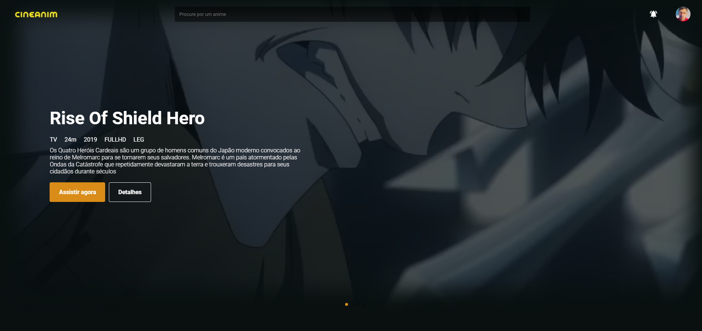

<h1 align="center">
  Cineanim-Frontend
</h1>


<p align="center">
  
  
  

  <a href="https://github.com/lyandeveloper/Cineanim-Frontend/commits/master">
    
  </a>

  <a href="https://github.com/lyandeveloper/Cineanim-Frontend/issues">
    
  </a>

  
  
  <a href="https://github.com/lyandeveloper/">
    
  </a>
</p> 



<p align="center">
  <a href="#-project">Project</a>&nbsp;&nbsp;&nbsp;|&nbsp;&nbsp;&nbsp;
  <a href="#technology">Technology</a>&nbsp;&nbsp;&nbsp;|&nbsp;&nbsp;&nbsp;  
  <a href="#how-to-run">How to run</a>&nbsp;&nbsp;&nbsp;|&nbsp;&nbsp;&nbsp; 
</p>

<br> 

## 💻 Project
Cineanim is a anime streaming platform.<br>

## Technology
This project was developed with the following technologies:

- [Node.js](https://nodejs.org/en/) 
- [NextJS](https://nextjs.org/) 

## How to run

1. Clone the project.

2. When cloning type in your terminal:

```sh
yarn or npm
``` 

3. Then start the server:

```sh
yarn dev or npm run dev
``` 


---

Made By ♥ [Elian Campos](https://github.com/lyandeveloper). Add me on [LinkedIn](https://www.linkedin.com/in/elian-campos/) :wave: 
